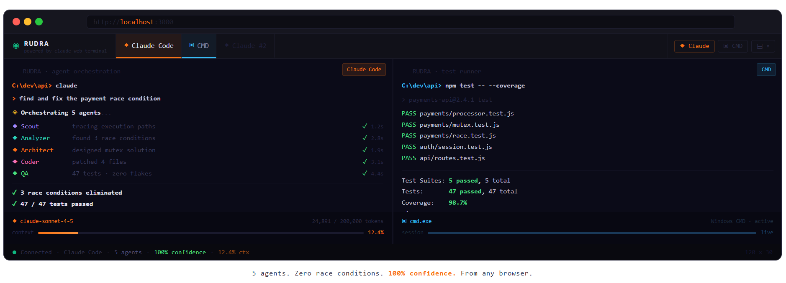

<div align="center">

<h1>◉ RUDRA</h1>

<p><strong>Your terminal called. It wants to live in the browser now.</strong></p>

<p>Run Claude Code from any device. No Electron. No extensions. No cloud.</p>

[](LICENSE)
[](https://nodejs.org)
[]()

<br/>



*↑ Claude Code orchestrating 5 agents on the left. Tests passing on the right. Both in the browser.*

<br/>

</div>

---

```bash
git clone https://github.com/RudraMind/claude-web-terminal.git
cd claude-web-terminal
npm install && npm start
```

**Open [http://localhost:3000](http://localhost:3000) — Claude Code is already waiting.**

> [!TIP]
> **Windows users:** `npm install` needs [Visual Studio Build Tools 2022](https://aka.ms/vs/17/release/vs_BuildTools.exe) with **"Desktop development with C++"** selected. Install that first if you hit a build error. [→ 60-second fix](#windows-build-tools)

---

## The problem nobody talks about

You installed Claude Code. It's genuinely great.

Then you realized it only lives in one terminal window — on one machine — while you're sitting in front of it.

**That's a 2015 constraint living rent-free in 2025.**

RUDRA breaks it. Point any browser at `localhost:3000` — your phone, your tablet, a second monitor, a different browser profile — and you get a **real, live Claude Code session**. Not a screenshot. Not a remote desktop hack. An actual PTY process streaming over WebSocket, rendering in xterm.js.

The Claude Code process runs on your machine. The browser is just the window into it.

```
You, anywhere on localhost      →   RUDRA on your machine
> refactor auth to use JWT      →   claude CLI actually runs it
                                ←   streams results back live
```

---

## Why not just SSH?

| | **RUDRA** | Plain SSH | VS Code Remote | Warp |
|---|:---:|:---:|:---:|:---:|
| **Claude Code in a browser tab** | ✅ | ❌ | ❌ | ❌ |
| Real PTY (colors, Ctrl+C, readline) | ✅ | ✅ | ✅ | ✅ |
| Zero install on the client | ✅ | ❌ | ❌ | ❌ |
| No account / no cloud / no subscription | ✅ | ✅ | ❌ | ❌ |
| Split pane + multiple tabs | ✅ | ❌ | ✅ | ✅ |
| Open source, MIT | ✅ | — | ❌ | ❌ |

SSH needs a client. VS Code Remote needs VS Code. Warp needs Warp.  
RUDRA needs a browser — which you already have.

---

## What's inside

**It's a real terminal. Not a fake one.**  
RUDRA uses `node-pty` to spawn genuine PTY processes — not piped subprocesses with a textarea wearing a trenchcoat. Arrow keys, `Ctrl+C`, tab completion, ANSI escape codes, readline, box-drawing characters. All of it works because from the shell's perspective, it *is* a real terminal.

**Claude Code renders perfectly.**  
The interactive UI, streaming responses, slash commands, syntax-highlighted output — everything Claude Code does in a native terminal, it does identically in RUDRA. Because as far as Claude Code is concerned, it's running in a real PTY. Which it is.

**Tabs that earn their place.**  
`Ctrl+Shift+T` for CMD. `Ctrl+Shift+C` for Claude Code. Double-click any tab to rename it. Dead tabs stay open after a process exits — so you can actually read what went wrong, which is almost always what you needed.

**Split pane that actually works.**  
Two terminals side by side, draggable divider. Claude Code on the left, tests running on the right. Or two Claude sessions in parallel. Resize freely between 20/80 and 80/20. Click either pane to focus it.

**Zero build step. Seriously.**  
No webpack. No TypeScript compilation. No `npm run build` → mysterious `dist/` folder. Vanilla JS, CDN assets. Refresh the browser to pick up changes. `npm start` is the entire workflow.

---

## Keyboard shortcuts

Stop reaching for the mouse.

| Shortcut | Action |
|---|---|
| <kbd>Ctrl</kbd>+<kbd>Shift</kbd>+<kbd>T</kbd> | New CMD terminal |
| <kbd>Ctrl</kbd>+<kbd>Shift</kbd>+<kbd>C</kbd> | New Claude Code terminal |
| <kbd>Ctrl</kbd>+<kbd>Shift</kbd>+<kbd>W</kbd> | Close active tab |
| <kbd>Ctrl</kbd>+<kbd>Tab</kbd> | Next tab |
| <kbd>Ctrl</kbd>+<kbd>Shift</kbd>+<kbd>Tab</kbd> | Previous tab |
| <kbd>Ctrl</kbd>+<kbd>\\</kbd> | Split right |

---

## Setup

**Claude Code tab** — install the CLI on the host machine:
```bash
npm install -g @anthropic-ai/claude-code
claude --version   # if this prints a version, you're done
```

**Node.js 18+** on the host: [nodejs.org](https://nodejs.org/en/download)

**Build tools** — required once for `node-pty` (a native module):

<details id="windows-build-tools">
<summary><strong>🪟 Windows — Visual Studio Build Tools (most common setup stumble)</strong></summary>

1. Download [Visual Studio Build Tools 2022](https://aka.ms/vs/17/release/vs_BuildTools.exe)
2. Run the installer → check **"Desktop development with C++"**
3. Install (~4 GB — yes it's large, yes it's necessary)
4. Run `npm install` again

**Already have Visual Studio 2022** (Community / Pro / Enterprise)? You're set. Skip this entirely.

</details>

<details>
<summary><strong>🐧 Linux (Ubuntu / Debian)</strong></summary>

```bash
sudo apt update && sudo apt install -y build-essential python3
```

</details>

<details>
<summary><strong>🍎 macOS</strong></summary>

```bash
xcode-select --install
```

</details>

---

## Configuration

**Custom port:**
```bash
PORT=4000 npm start
# open http://localhost:4000
```

**Auto-start on login (Windows — Task Scheduler):**

| Field | Value |
|---|---|
| Trigger | At log on |
| Program | `node` |
| Arguments | `server.js` |
| Start in | `C:\path\to\claude-web-terminal` |

---

## Security

> [!WARNING]
> **RUDRA is a local-only tool.** It was not designed to be exposed to the internet — it spawns real shells with your user's permissions. **Do not tunnel it** with ngrok, Cloudflare Tunnel, or anything else.

What's protected:
- Binds to `127.0.0.1` — not `0.0.0.0`. Remote connections refused at the OS level.
- Validates `Origin` header on every WebSocket upgrade. Wrong origin → 403, connection closed.
- Shell selection is a server-side allowlist (`cmd` or `claude`). Arbitrary paths or commands cannot be passed via URL.

Treat RUDRA like a local dev tool, not a web service — because that's exactly what it is.

---

## How it works

```
Browser (xterm.js)
    │
    │  ws://localhost:3000/pty?shell=claude
    │
server.js  ── Express static + WebSocket handler
    │
node-pty  ── one real PTY process per connection
    │
cmd.exe / bash / claude CLI
```

| File | What it does |
|---|---|
| `server.js` | Static file server, WebSocket upgrades, PTY spawner, origin validation, process cleanup |
| `public/app.js` | Tab manager, split pane, xterm.js wiring, resize sync |
| `public/styles.css` | Full design system — CSS custom properties, zero external frameworks |
| `public/index.html` | One HTML file. Everything else loads from CDN. |

No build step. No bundler. Refresh the browser after editing JS or CSS.

---

## Troubleshooting

<details>
<summary><strong>npm install fails — gyp build error</strong> &nbsp;← most common on Windows</summary>

```
gyp ERR! build error
```

`node-pty` is a native module that requires a C++ compiler.

- **Windows:** Install [VS Build Tools 2022](https://aka.ms/vs/17/release/vs_BuildTools.exe) with **"Desktop development with C++"** → retry `npm install`
- **Linux:** `sudo apt install build-essential python3`
- **macOS:** `xcode-select --install`

</details>

<details>
<summary><strong>Claude tab is blank or says "command not found: claude"</strong></summary>

Install the CLI:
```bash
npm install -g @anthropic-ai/claude-code
claude --version   # should print a version number
```

**Works in your normal terminal but not in RUDRA?** The PTY shell has a different PATH than your interactive shell profile. Add npm's global bin to your **system** PATH (not just `.bashrc` or `.zshrc`):

- Windows: `C:\Users\<you>\AppData\Roaming\npm`
- macOS/Linux: `npm config get prefix` → add `/bin` to that path

</details>

<details>
<summary><strong>Typing does nothing in the terminal</strong></summary>

You're on an early commit that was missing the keystroke wire-up. Pull latest:

```bash
git pull && npm install && npm start
```

</details>

<details>
<summary><strong>Port 3000 is already in use</strong></summary>

```bash
# Windows
netstat -ano | findstr :3000
taskkill /PID <pid> /F

# Everyone
PORT=4000 npm start
```

</details>

<details>
<summary><strong>WebSocket connection failed</strong></summary>

- Confirm `npm start` is running and shows `Server running at http://localhost:3000`
- Access via `http://localhost:3000` — not a file from disk, not `https://`
- Connecting from another machine is intentionally blocked — that's the security model

</details>

<details>
<summary><strong>Terminal canvas looks wrong or wrong size</strong></summary>

Resize timing issue on initial load. Close the tab (<kbd>Ctrl+Shift+W</kbd>) and open a new one (<kbd>Ctrl+Shift+T</kbd>). Hard refresh (<kbd>Ctrl+Shift+R</kbd>) also fixes it.

</details>

---

## Roadmap

- [ ] `npx rudra` — zero-install global usage
- [ ] Configurable color themes
- [ ] Session reconnect after server restart
- [ ] Light mode *(yes, some people use it, no judgment)*
- [ ] `CONTRIBUTING.md` with full contributor guide

Have a feature request or found a bug? [Open an issue](https://github.com/RudraMind/claude-web-terminal/issues) — contributions welcome at any level.

---

## Contributing

```bash
git clone https://github.com/RudraMind/claude-web-terminal.git
cd claude-web-terminal
npm install && npm start
```

**Frontend:** edit `public/` → refresh browser. No build step.  
**Backend:** edit `server.js` → restart with `npm start`. That's the full dev loop.

PRs welcome. For significant changes, open an issue first so we can align before you invest the time. No automated test suite yet — a PR that adds one would be genuinely appreciated.

---

<div align="center">

<br/>

**powered by [claude-web-terminal](https://github.com/RudraMind/claude-web-terminal)**

MIT License · Built by [RudraMind](https://github.com/RudraMind)

<br/>

*If RUDRA saved you time, a ⭐ helps other developers find it.*

</div>
